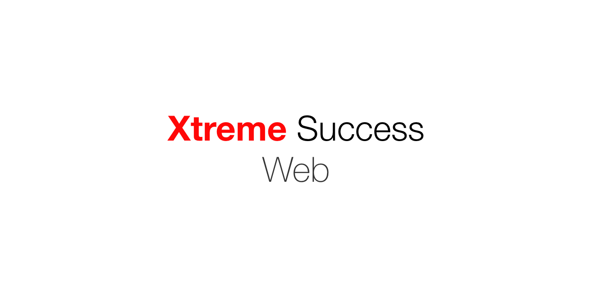

# Xtreme Success (Web)

This codebase serves as the front end (web) version for the Xtreme Success Project.

**Tools and Frameworks Used for this particular repo:**

| Tool               | Purpose                                         |
|--------------------|-------------------------------------------------|
| NodeJS NPM         | General purpose scripting and package managing. |
| Typescript         | Programming language used in the project        |
| AngularJS          | Frontend framework.                             |
| Markdown Rendering | Render markdown from server side                |
| Katex              | Render math equations                           |
| Bulma              | CSS Framework, Lightweight and Beautiful        |
| Razorpay           | Payment Provider                                |

Albert Einstein said **"Any fool can know. The point is to understand."**. Our motto is just that. Not just knowing what you are studying but we make sure that you understand them. We sat down with *great and experienced* teachers to curate a course pattern that is unlike any other and will help you in not just **getting good marks** but to also understand the subjects properly in order to help your future studies.

---
### Useful tools
#### Development server
Run `ng serve` for a dev server. Navigate to `http://localhost:4200/`. The app will automatically reload if you change any of the source files.

#### Build
Run `ng build` to build the project. The build artifacts will be stored in the `dist/` directory. Use the `--prod` flag for a production build.
